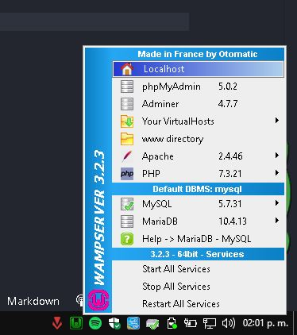
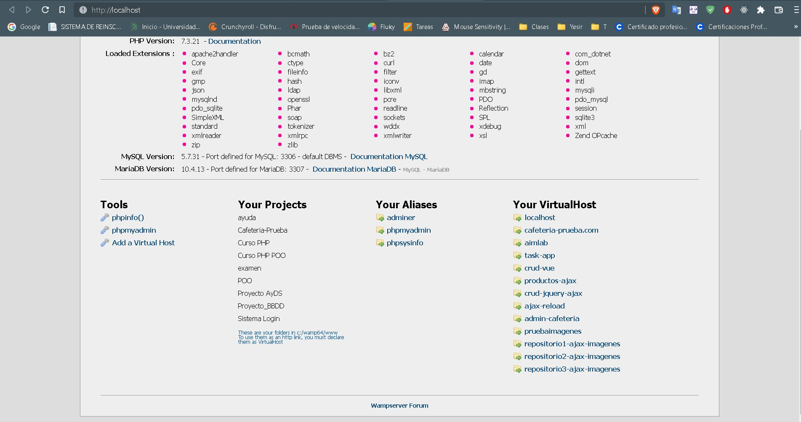
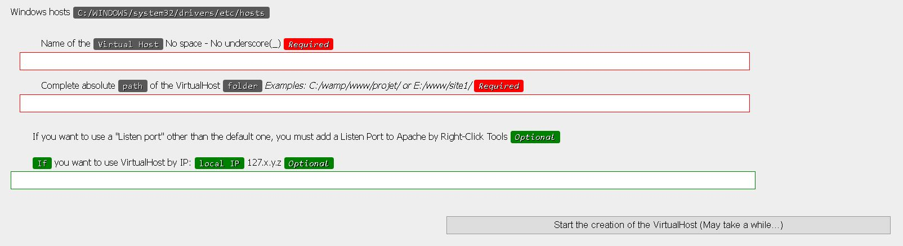
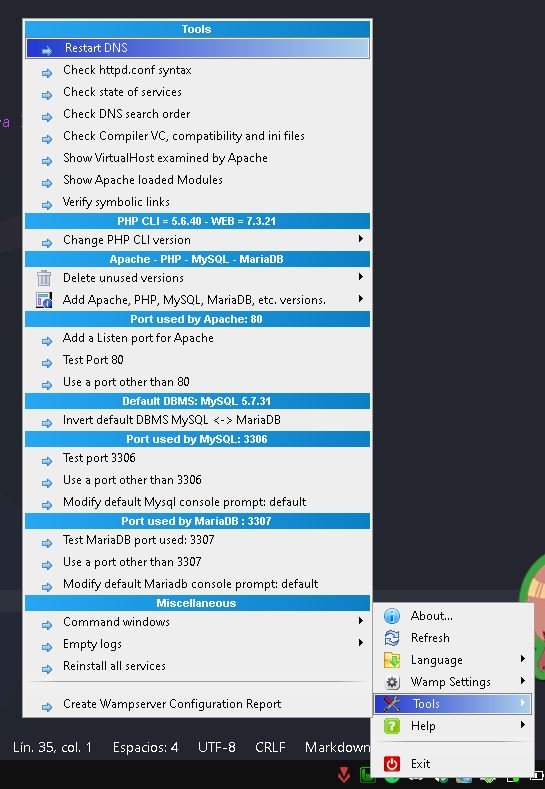
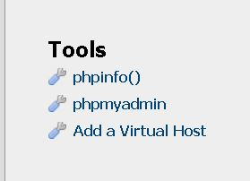
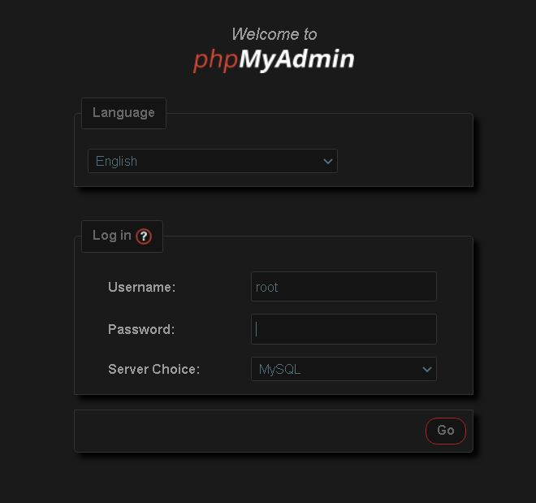
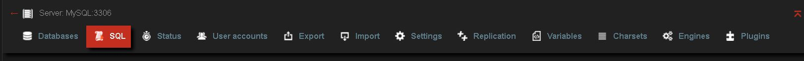

# Cafeteria-UABC
Aplicacion web para la cafeteria de la univerisdad uabc
# Cafeteria UABC

_Aplicacion para la cafeteria de UABC Sauzal (Lado de administrador compleatado)_

## Comenzando con el proyecto

_Para poder hacer las pruebas, se requiere de un servidor web Apache, en lo personal, recomiendo WampServer._
```
https://wampserver.uptodown.com/windows
```

### Instalación 

_La version mas estable del proyecto es la de la rama de Pruebas, recomiento usar git para la clonacion del repositorio_
_Para clonar el repositorio usaremos_
```
git clone --branch pruebas https://github.com/Erick1618/Cafeteria-UABC.git
```
_o_
```
git clone -b pruebas https://github.com/Erick1618/Cafeteria-UABC.git
```

_Ya descargado el repositorio, crearemos un VirtualHost en Wampserver_
!

_Accederemos al localhost y en la seccion de tools seleccionaremos "Add a Virtual Host"_
!

_Una vez dentro, ingresaremos en el primer input "cafeteria-prueba.com"_
_En el segundo input la direccion de la carpeta en la que se encuentra el repositorio_
_Y por ultimo solo daremos click en "Start the creation of the VirtualHost"_
!

_Para poder accerder a el virtual host, necesitamos reiniciar los DNS_
_Para ello, damos secundario en el simbolo de WampServer, seccion Tools y "Restart DNS"_
!

_Ahora necesitamos la base de datos_
_De nuevo en LocalHost, ahora necesitamos acceder a phpMyAdmin_
!

_Iniciamos sesion con root en MySql_
!

_Una vez adentro del PhpMyAdmin, accedemos a SQL_
!

_Ingresamos la siguiente sentencia SQL_

```
SET SQL_MODE = "NO_AUTO_VALUE_ON_ZERO";
START TRANSACTION;
SET time_zone = "+00:00";

DROP TABLE IF EXISTS `clientes`;
CREATE TABLE IF NOT EXISTS `clientes` (
  `id_cliente` int(11) NOT NULL AUTO_INCREMENT,
  `nombre_cliente` varchar(100) NOT NULL,
  `correo_cliente` varchar(255) NOT NULL,
  `puntos` int(11) DEFAULT NULL,
  PRIMARY KEY (`id_cliente`)
) ENGINE=MyISAM AUTO_INCREMENT=5 DEFAULT CHARSET=utf8;

INSERT INTO `clientes` (`id_cliente`, `nombre_cliente`, `correo_cliente`, `puntos`) VALUES
(1, 'Joel Ernesto Lopez Verdugo', 'joel.ernesto.lopez.verdugo@uabc.edu.mx', 0);

DROP TABLE IF EXISTS `comida`;
CREATE TABLE IF NOT EXISTS `comida` (
  `id_platillo` int(11) NOT NULL AUTO_INCREMENT,
  `nombre_platillo` varchar(100) NOT NULL,
  `descripcion_platillo` varchar(255) DEFAULT NULL,
  `foto_platillo` longblob NOT NULL,
  `tipo_platillo` int(11) DEFAULT NULL,
  PRIMARY KEY (`id_platillo`)
) ENGINE=MyISAM AUTO_INCREMENT=4 DEFAULT CHARSET=utf8;

INSERT INTO `comida` (`id_platillo`, `nombre_platillo`, `descripcion_platillo`, `foto_platillo`, `tipo_platillo`) VALUES
(2, 'Comida', 'Comida no desayuno', 0x313438303638393532342e6a7067, 1),
(3, 'Otra guarnicion', 'Solo se deben permitir 2 guarniciones', 0x3835333630303538352e6a7067, 1);

DROP TABLE IF EXISTS `desayuno`;
CREATE TABLE IF NOT EXISTS `desayuno` (
  `id_platillo` int(11) NOT NULL AUTO_INCREMENT,
  `nombre_platillo` varchar(90) NOT NULL,
  `descripcion_platillo` varchar(255) DEFAULT NULL,
  `foto_platillo` longblob NOT NULL,
  `tipo_platillo` int(11) DEFAULT NULL,
  PRIMARY KEY (`id_platillo`)
) ENGINE=MyISAM AUTO_INCREMENT=10 DEFAULT CHARSET=utf8;

INSERT INTO `desayuno` (`id_platillo`, `nombre_platillo`, `descripcion_platillo`, `foto_platillo`, `tipo_platillo`) VALUES
(2, 'Fuerte', 'Plato fuerte 2', 0x3530383134393638302e6a7067, 0),
(3, 'Guarnicion', 'Guarnicion 1', 0x313238343536313637302e6a7067, 1),
(4, 'Entrada', 'Es una entrada', 0x3539313233343635362e6a7067, 2),
(5, 'Cafe', 'Esta es la bebida del dia', 0x313335373537313137302e6a7067, 3),
(9, 'Plato fuerte fuerte', 'Es un plato fuerte', 0x3632383336393836392e6a7067, 0);

DROP TABLE IF EXISTS `empleados`;
CREATE TABLE IF NOT EXISTS `empleados` (
  `id_empleado` int(11) NOT NULL AUTO_INCREMENT,
  `nombre_empleado` varchar(90) NOT NULL,
  `correo_empleado` varchar(90) NOT NULL,
  `telefono_empleado` varchar(15) DEFAULT NULL,
  `status` int(11) DEFAULT NULL,
  PRIMARY KEY (`id_empleado`)
) ENGINE=InnoDB AUTO_INCREMENT=14 DEFAULT CHARSET=utf8;

INSERT INTO `empleados` (`id_empleado`, `nombre_empleado`, `correo_empleado`, `telefono_empleado`, `status`) VALUES
(1, 'LAMINATOTENSEI s', 'laminatotensei@gmail.com', '6151070062', 1),
(10, 'Johann', 'johann.peralta@uabc.edu.mx', '1234567890', 2),
(11, 'Erick Gabriel Santiago Suenaga', 'santiago.erick@uabc.edu.mx', NULL, 1),
(13, 'Nestor Lopez', 'heyyosoynestor@gmail.com', '124567890', 2);

DROP TABLE IF EXISTS `menu_rotativo`;
CREATE TABLE IF NOT EXISTS `menu_rotativo` (
  `id_menu` int(11) NOT NULL AUTO_INCREMENT,
  `menu` varchar(90) NOT NULL,
  `precio` int(11) NOT NULL,
  PRIMARY KEY (`id_menu`)
) ENGINE=MyISAM AUTO_INCREMENT=3 DEFAULT CHARSET=utf8;

INSERT INTO `menu_rotativo` (`id_menu`, `menu`, `precio`) VALUES
(1, 'desayuno', 150),
(2, 'comida', 150);

DROP TABLE IF EXISTS `platillos`;
CREATE TABLE IF NOT EXISTS `platillos` (
  `id_platillo` int(11) NOT NULL AUTO_INCREMENT,
  `nombre_platillo` varchar(40) NOT NULL,
  `descripcion_platillo` varchar(255) DEFAULT NULL,
  `precio_platillo` decimal(11,0) DEFAULT NULL,
  `categoria_platillo` int(11) DEFAULT NULL,
  `foto_platillo` longblob NOT NULL,
  `mostrar_platillo` int(11) DEFAULT NULL,
  PRIMARY KEY (`id_platillo`)
) ENGINE=MyISAM AUTO_INCREMENT=14 DEFAULT CHARSET=utf8;

INSERT INTO `platillos` (`id_platillo`, `nombre_platillo`, `descripcion_platillo`, `precio_platillo`, `categoria_platillo`, `foto_platillo`, `mostrar_platillo`) VALUES
(12, 'Comida prueba', 'Tal', '500', 2, 0x3835353235373436382e6a7067, 0),
(13, 'Sandias', 'Sandias picadas', '50', 1, 0x313637333938363039382e6a7067, 1),
(10, 'Comida 2', 'Mucha comida', '150', 4, 0x313436343934343936362e6a7067, 0),
(11, 'Tacoas', 'Tacoas al pastor', '120', 1, 0x313735353738393538302e6a7067, 0);
COMMIT;
```

_Con todo esto, ya tenemos todo listo para correr el lado de administrador del proyecto en nuestro virtual host_